# TP1DPBO2025C2
# JANJI
saya Rexy Putra Nur Laksana dengan NIM 2309578 berjanji mengerjakan Laporan Praktikum 1 dalam mata kuliah Desain dan Pemrograman Berorientasi Objek untuk keberkahanNya maka saya tidak melakukan kecurangan seperti yang telah dispesifikasikan. Aamiin.

# CPP
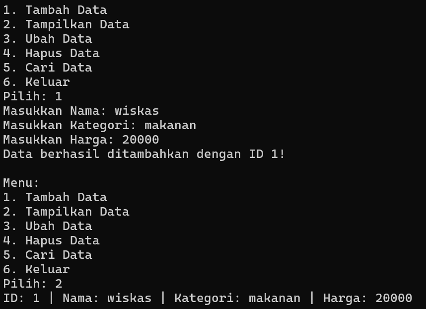
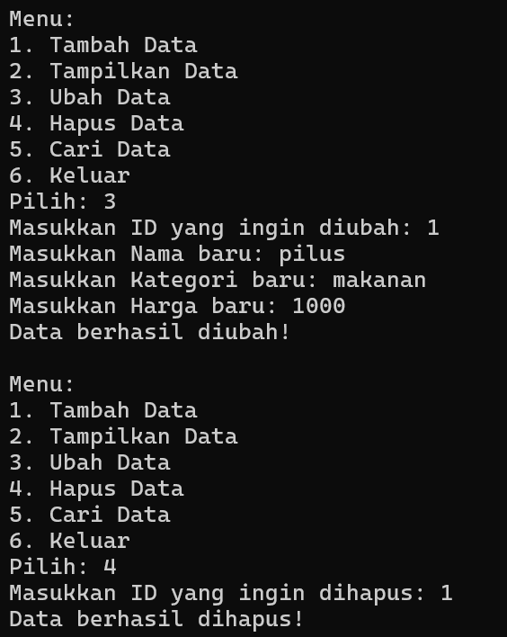
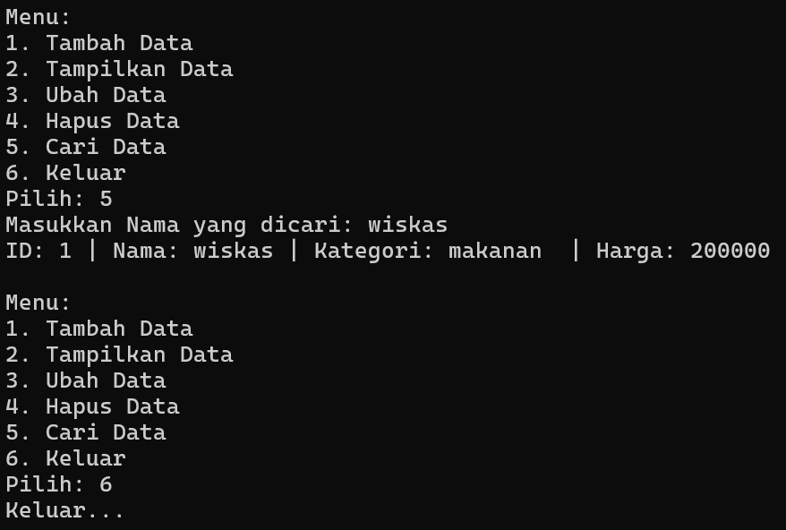

# PYTHON
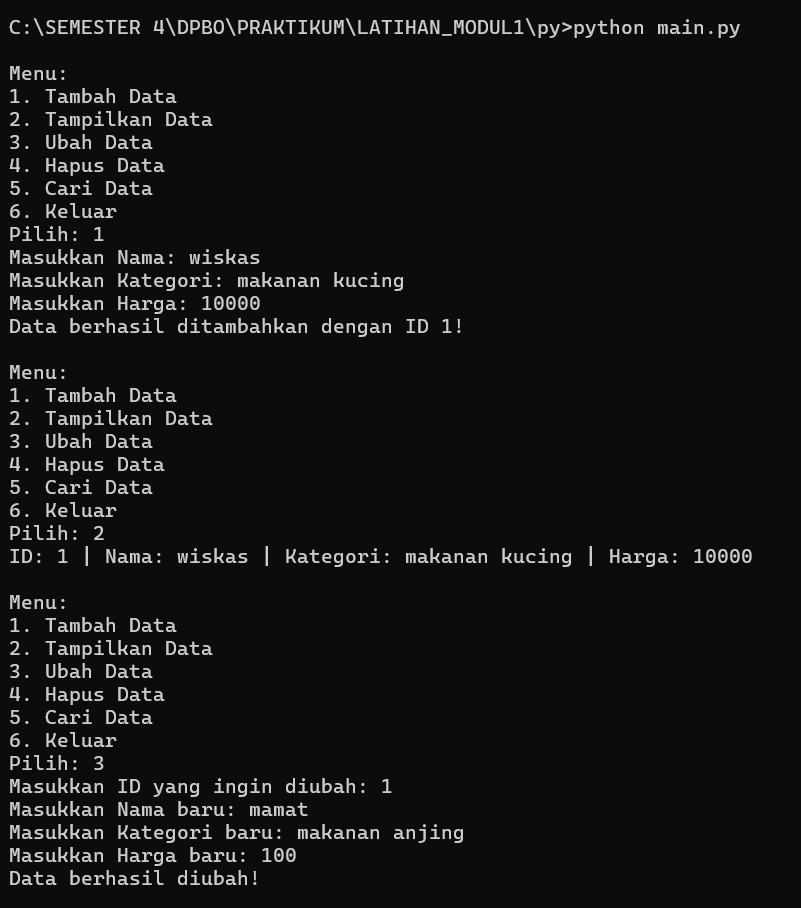
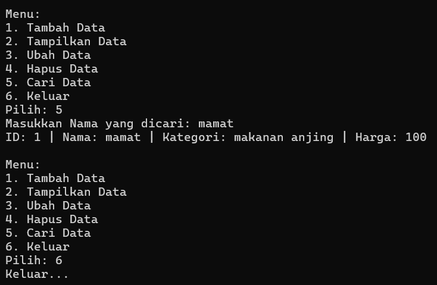

# JAVA
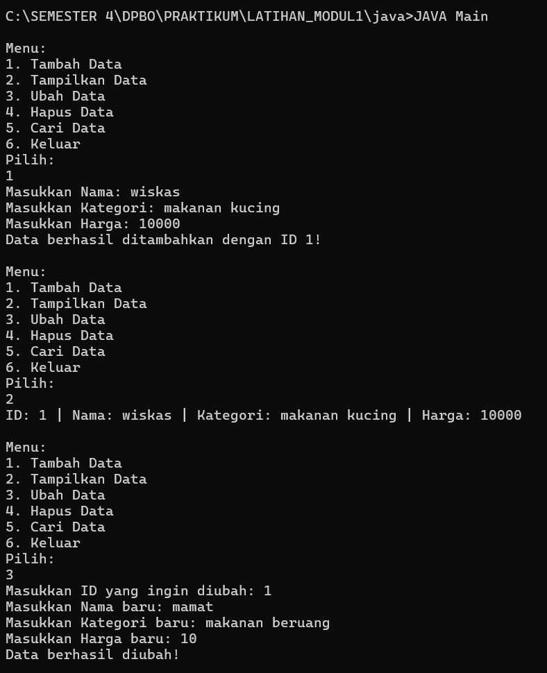
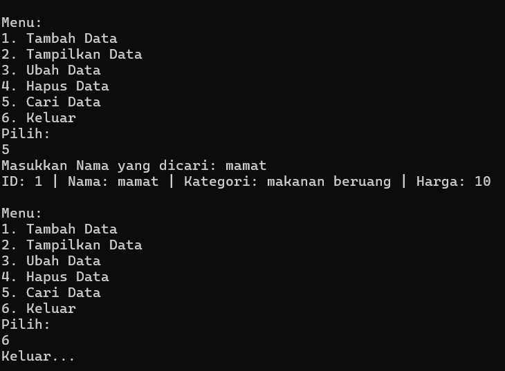

# PHP
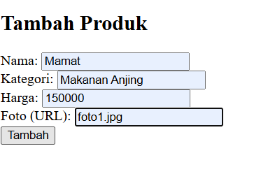
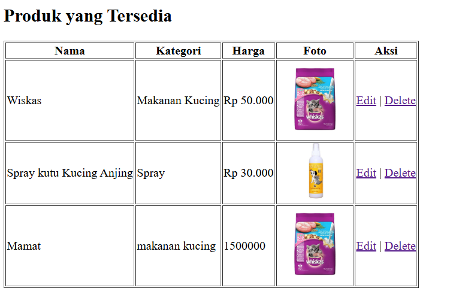

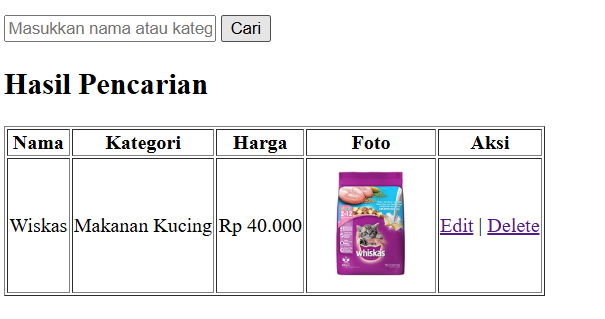
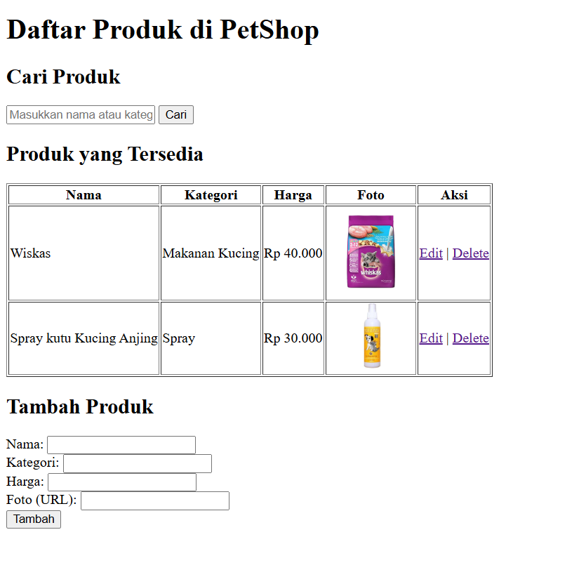
