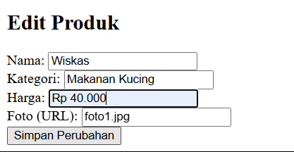

# TP1DPBO2025C2
# JANJI
saya Rexy Putra Nur Laksana dengan NIM 2309578 berjanji mengerjakan Laporan Praktikum 1 dalam mata kuliah Desain dan Pemrograman Berorientasi Objek untuk keberkahanNya maka saya tidak melakukan kecurangan seperti yang telah dispesifikasikan. Aamiin.

# CPP

Melalui perulangan do-while, program menampilkan menu interaktif dan meminta input pengguna. Pilihan diproses dengan switch-case, di mana setiap opsi menjalankan metode yang sesuai. Jika pengguna memilih 6, program menampilkan pesan keluar dan berhenti. Jika input tidak valid, program memberi peringatan dan meminta input ulang.

# PYTHON

Program menampilkan menu dalam perulangan while True dan meminta input pengguna. Pilihan diproses dengan if-elif, di mana setiap opsi menjalankan metode yang sesuai. Jika pengguna memilih 6, program menampilkan pesan keluar dan berhenti. Jika input tidak valid, program menampilkan peringatan.

# JAVA

Program menampilkan menu dalam perulangan do-while dan meminta input pengguna menggunakan Scanner. Pilihan diproses dengan switch-case, di mana setiap opsi menjalankan metode yang sesuai. Jika pengguna memilih 6, program menampilkan pesan keluar dan berhenti. Jika input tidak valid, program menampilkan peringatan.

# PHP

Saat pertama dijalankan, jika sesi belum ada, daftar produk awal akan dibuat. Program menyediakan fitur CRUD dan pencarian produk.

Menampilkan Produk: Data produk ditampilkan dalam tabel HTML.
Menambah Produk: Form input memungkinkan pengguna menambahkan produk baru ke daftar.
Mengubah Produk: Jika pengguna memilih edit, form akan diisi dengan data lama, lalu bisa diubah.
Menghapus Produk: Produk dapat dihapus dengan mengklik tombol delete.
Mencari Produk: Input pencarian memfilter produk berdasarkan nama atau kategori.
Semua perubahan disimpan dalam sesi sehingga data tetap ada selama sesi aktif.
